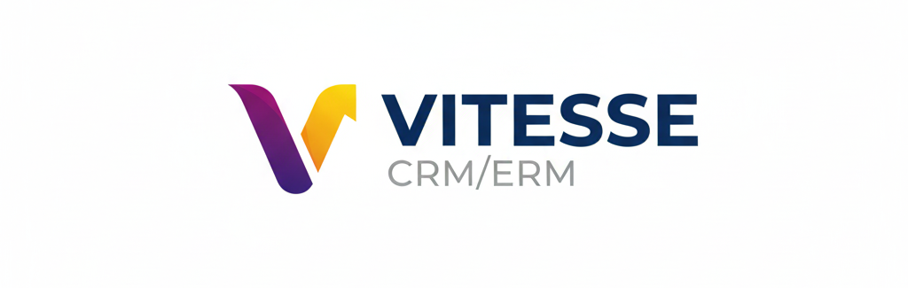
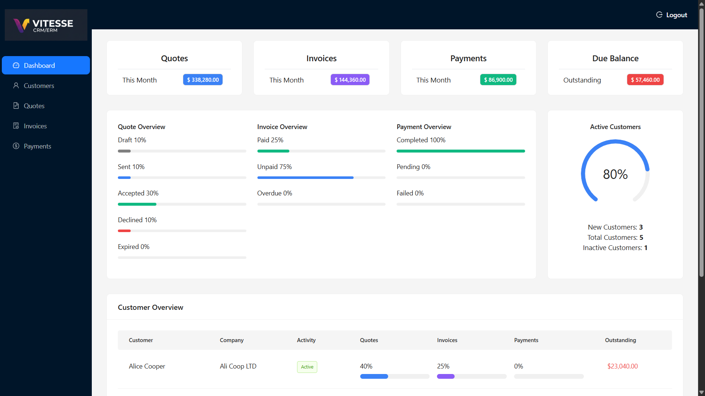

Vitesse is a full-stack CRM/ERP application built for self-employed professionals and small businesses.  
It manages the complete business workflow from customers and quotes to invoices, payments, and real-time analytics.

Built with Node.js and MongoDB on the backend, and React + TypeScript with Vite on the frontend.

##
  
More screenshots available in `./screenshots`.

---

## 📊 Features

- 👥 Customer & company management
- 📄 Quotes with automatic totals and expiry tracking
- 🧾 Invoices with quote conversion and overdue detection
- 💳 Payments (partial, multiple, multi-method)
- 💰 Revenue tracking and outstanding balances
- 📈 Real-time dashboard with KPIs and trends
- 🔐 Secure authentication with role-based access
- 🛡 Input validation, rate limiting, and error handling

---

## ⚙️ Tech Stack

### Backend:
- Node.js (ES Modules)
- Express.js
- MongoDB + Mongoose
- JWT authentication
- bcryptjs
- Security & middleware:
  - Helmet
  - express-rate-limit
  - mongo-sanitize
  - sanitize-html
  - express-validator
- Utilities:
  - Morgan
  - dayjs
  - dotenv
  - compression

---

### Frontend:
- React + TypeScript
- Vite
- Ant Design
- Tailwind CSS
- Zustand
- React Router
- Axios
- React Hook Form + Zod

---

###  Installation
👉 See [SETUP.md](SETUP.md) for full setup instructions.