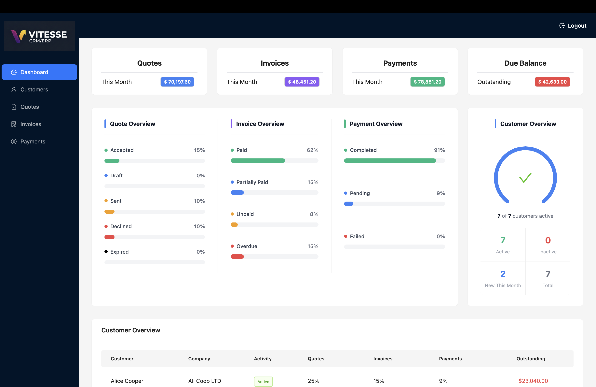

Vitesse is a full-stack CRM/ERP application built for self-employed professionals and small businesses.  
It manages the complete business workflow from customers and quotes to invoices, payments, and real-time analytics.

Built with Node.js and MongoDB on the backend, and React, TypeScript with Vite on the frontend.

📘 Author notes: See [AUTHOR_NOTES.md](/AUTHOR_NOTES.md) for the motivation, background, and design decisions behind this project.

### LiveDemo: [View on Railway](https://vitesse-crm-frontend-production.up.railway.app)

***Demo credentials***: `demo@vitesse.app` / `demo123`

> ⚠️ Note: The live demo is optimized for desktop. Mobile / small-screen layout is not supported yet.

---

###  📊 Features

- Customer & company management
- Quotes with automatic totals and expiry tracking
- Invoices with quote conversion and overdue detection
- Payments (partial, multiple, multi-method)
- Revenue tracking and outstanding balances
- Dashboard with KPIs and revenue overview
- Secure authentication (JWT + bcrypt)
- Input sanitization, rate limiting, and error handling

---

  
More screenshots available in `./screenshots`.

---

## ⚙️ Tech Stack

### Backend
- Node.js (ES Modules), Express.js
- MongoDB, Mongoose
- JWT authentication, bcryptjs
- Security: Helmet, express-rate-limit, mongo-sanitize, sanitize-html, express-validator
- Utilities: Morgan, dayjs, dotenv, compression

### Frontend
- React, TypeScript, Vite
- Ant Design, Tailwind CSS
- Zustand, React Router
- Axios
- React Hook Form, Zod

---

## 🏗 Architecture Overview

Vitesse is built as a clear frontend / backend split with strict responsibility boundaries.

👉 See [Architecture.md](/Architecture.md)

### Backend
- REST API built with Express (ES Modules)
- MongoDB with Mongoose models
- Stateless authentication via JWT access tokens
- Key domain rules enforced server-side (e.g. invoice creation constraints)

Key backend responsibilities:
- Sanitize all input
- Enforce domain rules (e.g. invoice creation constraints)
- Protect all resources with auth middleware
- Return consistent API errors

### Frontend
- React + TypeScript SPA
- API layer isolated from UI components
- Global auth state managed with Zustand
- Forms validated with React Hook Form + Zod
- Ant Design used for layout and components

Critical domain rules (e.g. invoice creation, payment status) are enforced by the backend, not the UI.

---

## 🧪 Testing Strategy

This project includes automated tests on both backend and frontend.

### Backend unit and integration tests
- Jest + Supertest
- mongodb-memory-server for isolated test database
- Auth flow tested (register, login, protected routes)
- CRUD endpoints tested with authorization
- Business rules tested (e.g. preventing invoice creation from declined/expired quotes)
- Tests drive fixes for discovered domain issues


Backend tests cover:
- Auth flow and protected routes
- Core CRUD with tenant isolation
- Key business rules (e.g. invoice creation from declined quotes)

### Frontend component tests
- Vitest + React Testing Library
- User-focused tests (not implementation details)
- Login form validation tested
- Customer list rendering tested with mocked API

Frontend tests ensure:
- Critical user flows work as expected
- UI logic is stable during refactors

---

## 🔁 Continuous Integration

The project includes a GitHub Actions CI pipeline that runs on every push and pull request.

CI checks:
- Backend tests
- Frontend tests

This ensures tests pass on every push.

---

## 🐳 Run with Docker

```bash
Start: docker compose up --build

Frontend: http://localhost:5173

Backend: http://localhost:8888

Stop: docker compose down
```
---
## 🌱 Demo Data

You can populate the database with demo data for quick evaluation.

Demo credentials:
- Email: demo@vitesse.app
- Password: demo123

Seed database:
```bash
# Local development
cd backend && npm run seed

# Docker
docker compose exec backend node scripts/seed.js
```
---
##  Installation
👉 See [SETUP.md](SETUP.md) for full setup instructions.